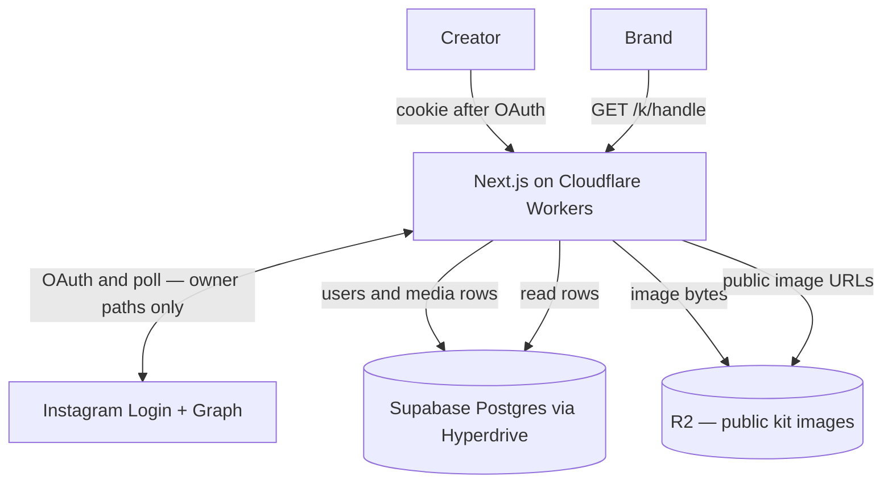

# Pitchkit architecture

**Docs:** [README](./README.md) · [plan](./PLAN.md) · [architecture](./ARCHITECTURE.md) · [data](./DATA.md) · [glossary](./GLOSSARY.md) · [AGENTS](./AGENTS.md)

Living picture of v1. Product: [PLAN.md](./PLAN.md). Columns: [DATA.md](./DATA.md).

The Phase 0 diagram is **mostly right**: Next.js on Cloudflare Workers, Instagram Login + Graph, Supabase Postgres through Hyperdrive, photos in R2, public kit at `/k/[handle]`, never put image bytes in SQL.

Two fixes so we do not build the wrong thing:

1. **`pitchkit.app` is one Worker**, not a second app. `/`, `/insights`, `/privacy`, `/delete`, and `/k/[handle]` are routes on that Worker. The kit URL does not talk to Postgres by itself.
2. **The public kit needs photos.** Postgres has rows and R2 keys. The browser loads images from **public R2** (or a Worker URL in front of R2). A diagram that only arrows the kit at Postgres is incomplete. The kit **does not** call Instagram.

---

## Picture



```text
Creator → Workers (OpenNext)
            → Instagram Login + Graph   (connect, refresh, Insights poll)
            → Supabase via Hyperdrive    = rows
            → R2                         = photos (public read)
         → /insights                     (owner, cookie; Pattern — creator Insights shell + Graph layout)
         → /k/[handle]                   (anyone; Postgres + R2; no Graph)

Brand  → /k/[handle] → same Worker → rows + public photos
```

**Postgres = index cards. R2 = photos. Never store image bytes in SQL.**

---

## Stack (locked)

Same table as [PLAN.md](./PLAN.md#stack-locked). Short version:

- **UI:** `@whatmatters/wmds` pattern-first + `styles.css`. App owns layout Tailwind only. No shadcn. No Storybook here (copy from WMDS Storybook).
- **App:** Next.js App Router, TypeScript, Tailwind v4, official OpenNext on Workers.
- **Icons:** Lucide through WMDS props. **Motion:** `motion` peer when WMDS needs it.
- **Install WMDS:** pin `github:thewhatmatters/wmds#cd18e7a29afd0c0d774552c1a3d665f480f51bd4` (CI cannot use `../wmds`). Local `../wmds` still works; `prepare` builds `dist/`. `@visx/visx` is the Chart peer. Cookie-gated Insights copies Pattern — creator Insights Show code (`examples-pitchkit--creator-insights`: `CREATOR_INSIGHTS_PAGE_CLASS` + hug `SegmentedControl` in a three-column PitchKit / control / Avatar header; PitchKit segment is an in-page Coming soon placeholder). Public `/k/[handle]` copies Pattern — shareable PitchKit (`examples-pitchkit--shareable-pitchkit`). Settings / landing keep `AppFrame` `OWNER_GRID_CLASS` with Tailwind `[--grid-max:1140px] [--grid-column-gap:8px] [--grid-gutter:8px]`. `GridOverlay` is Storybook-only. One root `Toaster`. Product toasts pass title + description. Insights body consumes Examples/PitchKit creator Insights (`PageHeader`, `Stat`, `Chart.Cartesian`, `Chart.RankedBars`, `Tab.Group`, `MoreMenu`, `AlertDialog`, `toast`). `npm test` fail-closes Pattern shell + owner gap tokens, owner proof `hidden_from_kit_at == null` partition, and Hide-from-kit `AlertDialog` dialog role. No AppShell / NavRail. Do not invent a Pitchkit Grid atom.
- **Charts:** WMDS `Chart` (visx peer). One 30-day account-reach area on `/insights` from `owner.reach_series` only. Insights + unusable series → State — insufficient reach data empty band (keep the Card; **No reach data yet**). Partial calendar holes in a plottable window use Chart.Cartesian `noData` hatch (`null` / omitted days; `0` is plotted) — wire the Show-code `noData` label through `ComponentProps` so OpenNext typecheck does not depend on cached `ChartCartesianProps` including that key; do not invent hatch UI. Graph-unavailable → omit the optional region. First connect / `?grid=pulling` is Pattern — creator Insights (loading). Retrieving after chrome is up is Header + `Chart.Loading`. Daily reach plus a constant Typical reach reference from the existing `typicalReach` median + `Chart.Legend` (Pattern ReachCard). No Stat `trend` deltas. Audience uses `Chart.RankedBars`; empty mixes keep the Audience Card with State — insufficient audience data (`No audience data yet`). Both empties can show at once. Never EXAMPLE percents. Never zero-fill. Public kit never receives the series. No Nivo in Pitchkit `package.json`.
- **Seed:** In-repo rows match [DATA.md](./DATA.md). `TOKEN_KEY` not required (seed tokens are null). Disconnect stamps `disconnected_at` + nulls tokens on the KV Graph snapshot (`writeGraphSnapshot`); SQL + R2 purge still waits on Hyperdrive. Public `/k/demo` has no Insights (`reach_series` omitted) and stays the shared seed (no snapshot → persist is a no-op). Owner Insights seed includes example `reach_series` when no token (not a SQL table). Live token replaces that with a Graph poll.

---

## What each box does

| Piece | Role |
|---|---|
| Workers / OpenNext | All HTML and APIs. Sets the httpOnly session cookie. Encrypts tokens with `TOKEN_KEY` before SQL (or KV snapshot until Hyperdrive). Postgres client is `postgres` (postgres.js) on `env.HYPERDRIVE.connectionString` — fresh client per request, parameterized `$1` queries, no ORM (`lib/postgres.ts`). OpenNext typecheck asserts those rows through `unknown` (`asQueryRows`) because postgres.js `Row & Iterable<Row>` does not overlap a caller `T extends SqlQueryRow`. `/auth/instagram` is Instagram Business Login when app secrets exist; otherwise stub `pitchkit_session` for seed `demo`. Landing shows the quiet demo-session line only on the stub path. A resolvable session on `GET /` redirects to `/insights`. `/auth/sign-out` clears the session and `pitchkit_hidden` (kit stays public). `/auth/disconnect` does that plus stamps `disconnected_at` and nulls token fields (SQL when Hyperdrive is bound; else the KV Graph snapshot) so we stop polling; `assemblePublicKit` then 404s `/k/[handle]`. Hide/restore: `POST /api/media/hide` and `POST /api/media/restore` (`{ mediaId }` → `{ mediaId, hiddenFromKitAt }`). Seed SoT is KV `HIDDEN_KIT` until Hyperdrive; Graph snapshots reuse that binding under `graph:` keys when Hyperdrive is absent. When the binding is present, SQL is SoT for `users` / `media` / `hidden_from_kit_at` (`reach_series` + audience stay `graph:payload:` extras). httpOnly `pitchkit_hidden` is the owner reload mirror so anon `/k/[handle]` sees hides across isolates. FE calls the routes only (no localStorage). Owner Insights partitions `hidden_from_kit_at` so reload **"N shown"** excludes hidden rows; Hidden + Restore chrome stay. Workers Builds non-prod is `npx wrangler versions upload`; `wrangler.jsonc` `build.command` is `npx opennextjs-cloudflare build` so `.open-next/worker.js` exists. |
| Instagram | Login and Graph **only while the creator is connecting or we are polling**. Host `graph.instagram.com`. Pin `GRAPH_API_VERSION` (v25.0). No webhooks in v1. Stub connect does not call Graph. Poll: `GET /me`, one `/media` page, per-media `/insights` (`reach,views,saved,shares`), user `reach` `time_series`, `follower_demographics`. |
| Hyperdrive → Supabase | Live SoT when bound: `users`, `media`, empty `detections` and `weekly_counts`. Host is **Supabase Postgres**. Bindings: `HYPERDRIVE` / `HYPERDRIVE_PREVIEW` (ids stay commented in `wrangler.jsonc` until Randy supplies them). Origin URI is the Supabase **direct** connection (port 5432), not the transaction pooler (6543). Workers use postgres.js on `env.HYPERDRIVE.connectionString` — not `@supabase/supabase-js`. Detection is explicit (`lib/hyperdrive.ts`) — missing / empty `connectionString` keeps the KV + seed path. Until Hyperdrive exists, `/k/demo` and `/insights` read `lib/seed.ts` — same types as live. Schema SQL: `db/*.sql` via `npm run db:apply`. |
| R2 `pitchkit-media` | Bytes. Public read for kit objects. Keys on `avatar_r2_key` / `r2_key`. Prefix `{user_id}/`. |
| `/k/[handle]` | Last stored snapshot. Handle frozen at first connect by default. Optional WHA-313 URL update on reconnect if the Instagram username differs (default = keep; old path 404s, no redirect). If the token is dead, this page still works. |
| Cloudflare / Support | randy@whatmatters.so until we change it |

---

## What is not in this picture (on purpose)

D1, Vercel, shadcn, queues, Browser Run, Workers AI, Storybook in Pitchkit, a second database, TikTok, PDF, signed URLs for kit images, live Graph on the public kit.

---

## Delete

Owner disconnect → Worker deletes Supabase rows for that creator and R2 `{user_id}/` within 24 hours. Public kit 404s. Anonymous `weekly_counts` may remain.
