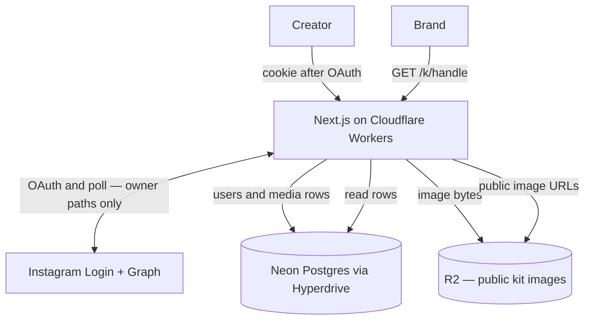

# Pitchkit architecture

**Docs:** [README](./README.md) · [plan](./PLAN.md) · [architecture](./ARCHITECTURE.md) · [data](./DATA.md) · [glossary](./GLOSSARY.md) · [AGENTS](./AGENTS.md)

Living picture of v1. Product: [PLAN.md](./PLAN.md). Columns: [DATA.md](./DATA.md).

The Phase 0 diagram is **mostly right**: Next.js on Cloudflare Workers, Instagram Login + Graph, Neon through Hyperdrive, photos in R2, public kit at `/k/[handle]`, never put image bytes in SQL.

Two fixes so we do not build the wrong thing:

1. **`pitchkit.app` is one Worker**, not a second app. `/`, `/insights`, `/privacy`, `/delete`, and `/k/[handle]` are routes on that Worker. The kit URL does not talk to Postgres by itself.
2. **The public kit needs photos.** Postgres has rows and R2 keys. The browser loads images from **public R2** (or a Worker URL in front of R2). A diagram that only arrows the kit at Postgres is incomplete. The kit **does not** call Instagram.

---

## Picture



```text
Creator → Workers (OpenNext)
            → Instagram Login + Graph   (connect, refresh, Insights poll)
            → Neon via Hyperdrive        = rows
            → R2                         = photos (public read)
         → /insights                     (owner, cookie; Graph layout — SegmentedControl nav, 960 grid)
         → /k/[handle]                   (anyone; Postgres + R2; no Graph)

Brand  → /k/[handle] → same Worker → rows + public photos
```

**Postgres = index cards. R2 = photos. Never store image bytes in SQL.**

---

## Stack (locked)

Same table as [PLAN.md](./PLAN.md#stack-locked). Short version:

- **UI:** `@whatmatters/wmds` pattern-first + `styles.css`. App owns layout Tailwind only. No shadcn. No Storybook here (copy from WMDS Storybook).
- **App:** Next.js App Router, TypeScript, Tailwind v4, official OpenNext on Workers.
- **Icons:** Lucide through WMDS props. **Motion:** `motion` peer when WMDS needs it.
- **Install WMDS:** pin `github:thewhatmatters/wmds#975b649499da7b54cbc3acbac70dde5e2d9bb915` (CI cannot use `../wmds`). Local `../wmds` still works; `prepare` builds `dist/`. `@visx/visx` is the Chart peer. Owner views: `grid-page` + `band` with Tailwind arbitrary props `[--grid-max:960px] [--grid-column-gap:8px] [--grid-gutter:8px] [--grid-cols:12]` (not React `style` vs `@theme`; both gap tokens until WMDS column-gap reads `--grid-column-gap`), and WMDS `SegmentedControl` (Insights / Pitch). `AppFrame` mounts WMDS `GridOverlay` (`visibleByDefault`; press **g**) as a direct child of `grid-page`. Band children are grid items — Insights four-up wraps each Stat in a `div` with `col-span-6` (mobile 2×2) and `md:col-span-3` (4×3=12; full class strings in JSX). Owner nav, private badge, Chart, posts, and footer use `col-span-full`. No AppShell / NavRail. Do not invent a Pitchkit Grid atom.
- **Charts:** WMDS `Chart` (visx peer). One 30-day account-reach area on `/insights` from `owner.reach_series` only. Empty/omit or no plot ink → hide the entire Chart band (not a header + empty 240px ParentSize host). `Chart.Cartesian` data is `{ date: Date, reach: number }[]`; `animate="none"` + `Chart.Cartesian.Area` + `Chart.Cartesian.Tooltip` inside a WMDS `Card`. Date-tick budget uses WMDS `chartMaxTicksForWidth` (~3 on a phone). Never zero-fill. Public kit never receives the series. No Nivo in Pitchkit `package.json`.
- **Seed:** In-repo rows match [DATA.md](./DATA.md). `TOKEN_KEY` not required (seed tokens are null). Disconnect columns exist; no live delete yet. Public `/k/demo` has no Insights (`reach_series` omitted). Owner Insights seed includes example `reach_series` (not a SQL table, not live Graph).

---

## What each box does

| Piece | Role |
|---|---|
| Workers / OpenNext | All HTML and APIs. Sets the httpOnly session cookie. Encrypts tokens with `TOKEN_KEY` before SQL. Until live OAuth, stub `/auth/instagram` sets `pitchkit_session` for seed `demo` (not a token). `/auth/sign-out` clears it. |
| Instagram | Login and Graph **only while the creator is connecting or we are polling**. Pin `GRAPH_API_VERSION`. No webhooks in v1. Stub connect does not call Graph. |
| Hyperdrive → Neon | `users`, `media`, empty `detections` and `weekly_counts`. Bindings: `HYPERDRIVE` / `HYPERDRIVE_PREVIEW`. Until Hyperdrive exists, `/k/demo` and `/insights` read `lib/seed.ts` — same types as live. Schema SQL: `db/*.sql`. |
| R2 `pitchkit-media` | Bytes. Public read for kit objects. Keys on `avatar_r2_key` / `r2_key`. Prefix `{user_id}/`. |
| `/k/[handle]` | Last stored snapshot. If the token is dead, this page still works. |
| Cloudflare / Support | randy@whatmatters.so until we change it |

---

## What is not in this picture (on purpose)

D1, Vercel, shadcn, queues, Browser Run, Workers AI, Storybook in Pitchkit, a second database, TikTok, PDF, signed URLs for kit images, live Graph on the public kit.

---

## Delete

Owner disconnect → Worker deletes Neon rows for that creator and R2 `{user_id}/` within 24 hours. Public kit 404s. Anonymous `weekly_counts` may remain.
