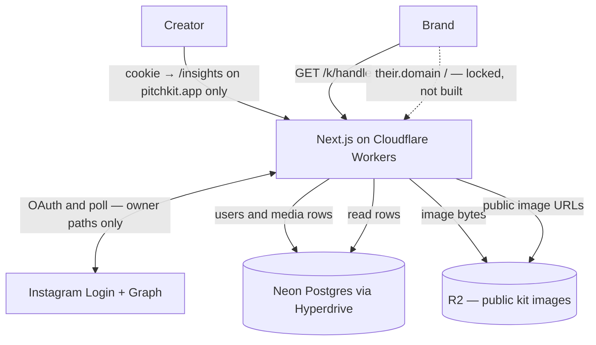

# Pitchkit architecture

**Docs:** [README](./README.md) · [plan](./PLAN.md) · [architecture](./ARCHITECTURE.md) · [data](./DATA.md) · [AGENTS](./AGENTS.md)

Living picture of v1. Product: [PLAN.md](./PLAN.md). Columns: [DATA.md](./DATA.md).

The Phase 0 diagram is **mostly right**: Next.js on Cloudflare Workers, Instagram Login + Graph, Neon through Hyperdrive, photos in R2, public kit at `/k/[handle]`, never put image bytes in SQL.

Two fixes so we do not build the wrong thing:

1. **`pitchkit.app` is one Worker**, not a second app. `/`, `/insights`, `/privacy`, `/delete`, and `/k/[handle]` are routes on that Worker. The kit URL does not talk to Postgres by itself.
2. **The public kit needs photos.** Postgres has rows and R2 keys. The browser loads images from **public R2** (or a Worker URL in front of R2). A diagram that only arrows the kit at Postgres is incomplete. The kit **does not** call Instagram.

---

## Picture



```text
Creator → Workers (OpenNext)
            → Instagram Login + Graph   (connect, refresh, Insights poll)
            → Neon via Hyperdrive        = rows
            → R2                         = photos (public read)
         → /insights on pitchkit.app     (owner, httpOnly cookie; never on a custom host)
         → /k/[handle]                   (anyone; Postgres + R2; no Graph)

Brand  → pitchkit.app/k/[handle] → same Worker → same public kit
Brand  → their.domain /          → same Worker → same public kit
         (custom host: locked, not built; dashed; no redirect either way)
```

**Postgres = index cards. R2 = photos. Never store image bytes in SQL.**

### Custom domains (locked, not built)

Product lock only. The dashed Brand edge is **not live**. Do not implement a `Host` lookup. Do not add a `users.custom_hostname` column.

- **Both URLs, same kit.** `pitchkit.app/k/[handle]` stays the share URL. `their.domain` `/` is the same public kit. No forced redirect either way.
- **Insights stays on `pitchkit.app`.** The httpOnly session cookie is set and read there only. Custom hosts never get the session.
- **Mechanism (when we build, not now):** Cloudflare for SaaS on the `pitchkit.app` zone. The Worker is the fallback origin (`*/*` route). Custom Hostnames API. `Host` header maps to handle. Creators CNAME `kit.brand.com` → `customers.pitchkit.app`. HTTPS is Cloudflare’s certificate — never paste keys. Cloudflare Access stays off public kits. The preview Worker must not accept production custom hostnames. R2 and other assets can stay on `pitchkit.app`.
- **Apex is out of this lock.** Cloudflare Apex Proxying is Enterprise. Subdomain CNAME first.

---

## Stack (locked)

Same table as [PLAN.md](./PLAN.md#stack-locked). Short version:

- **UI:** `@whatmatters/wmds` pattern-first + `styles.css`. App owns layout Tailwind only. No shadcn. No Storybook here (copy from WMDS Storybook).
- **App:** Next.js App Router, TypeScript, Tailwind v4, official OpenNext on Workers.
- **Icons:** Lucide through WMDS props. **Motion:** `motion` peer when WMDS needs it.
- **Install WMDS:** `../wmds` or `github:thewhatmatters/wmds`; `npm run build` in WMDS so `dist/` exists.

---

## What each box does

| Piece | Role |
|---|---|
| Workers / OpenNext | All HTML and APIs. Sets the httpOnly session cookie. Encrypts tokens with `TOKEN_KEY` before SQL. |
| Instagram | Login and Graph **only while the creator is connecting or we are polling**. Pin `GRAPH_API_VERSION`. No webhooks in v1. |
| Hyperdrive → Neon | `users`, `media`, empty `detections` and `weekly_counts`. Bindings: `HYPERDRIVE` / `HYPERDRIVE_PREVIEW`. |
| R2 `pitchkit-media` | Bytes. Public read for kit objects. Keys on `avatar_r2_key` / `r2_key`. Prefix `{user_id}/`. |
| `/k/[handle]` | Last stored snapshot. If the token is dead, this page still works. |
| Cloudflare / Support | randy@whatmatters.so until we change it |

---

## What is not in this picture (on purpose)

D1, Vercel, shadcn, queues, Browser Run, Workers AI, Storybook in Pitchkit, a second database, TikTok, PDF, signed URLs for kit images, live Graph on the public kit.

---

## Delete

Owner disconnect → Worker deletes Neon rows for that creator and R2 `{user_id}/` within 24 hours. Public kit 404s. Anonymous `weekly_counts` may remain.
